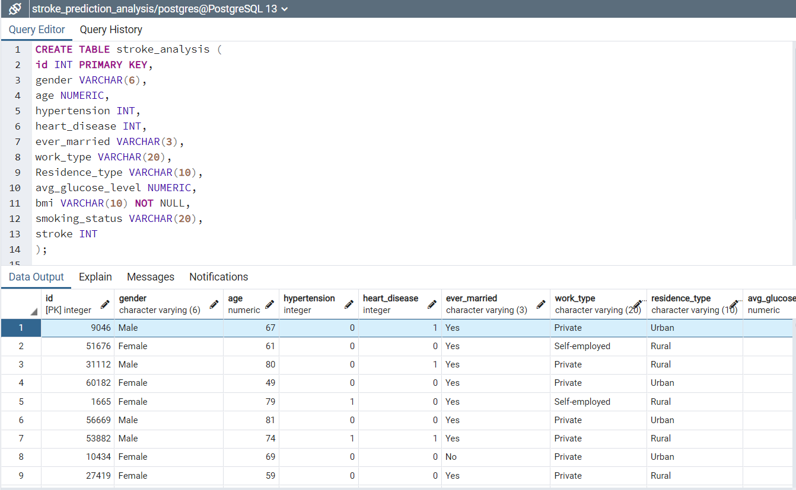

# Stroke Prediction Analysis

In this project, a dataset containing 11 clinical features for patients that classifies whether or not they have had a stroke will be analyzed. The purpose of this project is to derive insight on characteristics and statistics regarding these patients, to create a machine learning model that can determine whether a patient is at high risk of having a stroke, and determine which factors influence whether a patient has had a stroke.

## Communication

Initial team meeting via Zoom. Discussed project requirements and assigned individual responsibilities.
Weekly team meetings via Zoom occur twice per week during our scheduled class time.
Team communication via Slack as needed to update team members of progress and to ask for assistance.

---

## Group Members

Caitlin Bishop,
Alex Borden,
Andrew Carlson,
Brandon Castro

## Resources

Data Source: The healthcare-dataset-stroke-data.csv from the [Kaggle Website](https://www.kaggle.com/datasets/fedesoriano/stroke-prediction-dataset?resource=download), credit to the author of the dataset fedesoriano.

Tools: Jupyter Notebook, Visual Studio Code, Python, Pandas, Numpy, Seaborn, MatPlotLib, Supervised Machine Learning Binary Classification Model, PostgreSQL, and Tableau. 

## Technologies Used

### Data Cleaning and Analysis
Jupyter Notebook, along with Python's Pandas, Numpy, and seaborn libraries will be used to clean the data and perform an exploratory/statistical analysis. 

### Database Storage
Data will be stored and queried from in a PostgreSQL database.

### Machine Learning
Python's scikit-learn will be employed to create a supervised machine learning binary classification model using the stroke patient data csv file. The goal is to create a model that is able to determine whether or not a patient is at a high risk of having a stroke based on various characteristics of the patient.

### Dashboard
Our dashboard will be hosted on Tableau Public software, to create a fully functioning and interactive dashboard and story to visualize and present data/findings. 

[Stroke Prediction Analysis Dashboard Link](https://public.tableau.com/views/StrokePredictionInteractiveDashboard/StrokePredictionInteractiveDashboard?:language=en-US&publish=yes&:display_count=n&:origin=viz_share_link)

### **Roles:** 
* Caitlin Bishop: GitHub/Data Cleaning/Exploratory Analysis/Presentation
* Alex Borden: Technology/Dashboard
* Andrew Carlson: Machine Learning Model 
* Brandon Castro: SQL-based Database

# Segment 1

## Presentation

[Link to Presentation on Google Slides](https://docs.google.com/presentation/d/1cDEaOqquFxIjPL7FS63isOqBU7swg3fR8Z7BzpkdH48/edit?usp=sharing)

* Selected topic
    * Stroke Prediction Analysis

* Reason they selected the topic
    * Stroke prediction was the topic chosen because of our common background/interest in the healthcare field. 

* Description of the source of data
    * The data contains 11 clinical features regarding medical patients including patient id, gender, age, hypertension status,	heart disease status, marital status, employment type, residence type, average glucose levels, body mass index(BMI), and smoking status. There is also a target vector that states whether or not a given patient has had a stroke.

* Questions they hope to answer with the data
    * Can the classification model determine whether or not a patient could have a stroke?
    * What factors influence whether or not a stroke would occur the most?
    * Through our analysis, can we find who is most susceptible to getting a stroke? 

---

## GitHub Repository 

* README.md
* Description of the communication protocols

---

## Database Integration 
Plan for storing data in a PostgreSQL database:  

1. Create a table in pgAdmin4 for which the csv file will be uploaded into.
2. Create two other tables from the main table, one for biological characteristics of patients, and one for demographic.
3. Perform queries to gather statistical insight on the data.

---

## Machine Learning Model

The csv dataset will be read in as a Pandas dataframe and will be used for the machine learning model. The output for the model will be the prediction of whether or not the patient had a stroke. As mentioned above, the goal is to create a model that is able to determine whether or not a patient is at a high risk of having a stroke based on the features of the patient in the dataset. If the output for a patient state that they had a stroke, then the patient may have a high risk of having a stroke according to their features. 

# Segment 2

## Machine Learning Model

See the [gradient_boosting_model.ipynb](https://github.com/bishopce16/stroke_prediction_analysis/blob/main/Machine_Learning/gradient_boosting_model.ipynb) file in the [machine_learning](https://github.com/bishopce16/stroke_prediction_analysis/tree/main/Machine_Learning) folder for a description of data preprocessing, feature engineering, feature selection, data splitting for training/testing of model, and gradient boosting model creation.  

##  Database 

The csv file was imported into a postgreSQL database as a table using the following SQL query: 

 

Below is a portion of the resulting table: 

## Story & Dashboard 

We will be utilizing Tableau Public to create a story-based dashboard in combination with an interactive dashboard. 

[Stroke Prediction Analysis Story Link](https://public.tableau.com/views/StrokePredictionAnalysisStory/StrokePredictionAnalysisStory?:language=en-US&publish=yes&:display_count=n&:origin=viz_share_link)

Here is a sneak peak of the story points we will using inside Tableau. 

### BMI Calculator 

### Age vs Stroke

### Stroke Percentage of Marital Status 

## Interactive Dashboard 

Our interactive dashboard created in Tableau includes 8 different correlations for identifying trends in the stroke dataset includes the following:

* Averages
* Age & Stroke
* Gender & Work Type 
* Heart Disease and Hypertension
* Impact of Marriage 
* Impact of Residence Type
* Impact of Smoking Status
* BMI & Glucose Calculators

This dashboard is fully functional with a Gender & Work Type bar chart that identifies trends of stroke predictions in Male and Females.

[Stroke Prediction Analysis Dashboard Link](https://public.tableau.com/views/StrokePredictionInteractiveDashboard/StrokePredictionInteractiveDashboard?:language=en-US&publish=yes&:display_count=n&:origin=viz_share_link)

# Segment 3

## Machine Learning Model

See the [gradient_boosting_model.ipynb](https://github.com/bishopce16/stroke_prediction_analysis/blob/main/Machine_Learning/gradient_boosting_model.ipynb) file in the [machine_learning](https://github.com/bishopce16/stroke_prediction_analysis/tree/main/Machine_Learning) folder for optimization methods used for the model, results after optimization, determination of feature importances, and conclusion of the machine learning analysis.

## Story & Dashboard 

Finalized the Dashboard/Story and added Exploratory Analysis and Machine Learning to show importance within the Tableau story. 

### Exploratory Analysis

### Machine Learning

### Finalized Dashboard

## Database

SQL Script tables [ERD_DB_creation.sql](https://github.com/bishopce16/stroke_prediction_analysis/tree/main/Database)

Below are portions of the resulting tables

Biological Features Table

Demographic Features Table

# Segment 4

Final Presentation

[Stroke Prediction Analysis Dashboard Link](https://public.tableau.com/views/StrokePredictionInteractiveDashboard/StrokePredictionInteractiveDashboard?:language=en-US&publish=yes&:display_count=n&:origin=viz_share_link)
